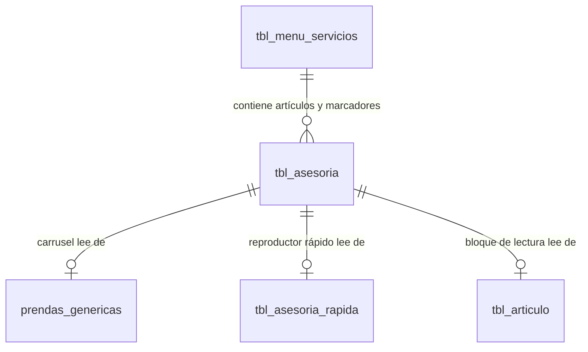

# Proceso de Publicación de Artículos y Componentes en TheorIA M

Este documento describe la estructura y el procedimiento técnico para publicar contenido (tanto artículos estáticos como componentes dinámicos) en la sección de Asesorías.

---

## 🗺️ Arquitectura de Contenidos

El sistema utiliza una base de datos relacional (SQLite, `asesoria.db`) que gestiona el menú del sidebar, los artículos de lectura y las incrustaciones de widgets dinámicos personalizados por usuario.

---

## 📋 Pasos para la Publicación

### Paso 1: Definir la Categoría o Menú (Si es necesario)
Si el artículo pertenece a un nuevo tema o subtema que no está en el menú lateral, se debe registrar en la tabla `tbl_menu_servicios`:

* **Tabla**: `tbl_menu_servicios`
* **Campos clave**:
  * `tema`: Categoría principal (ej: `Introducción`, `Diagnóstico`, `Aprender`).
  * `subtema`: Título de la opción en el sidebar (ej: `Análisis de Color`, `Estudio Morfológico`).
  * `texto_derecho_html`: Texto introductorio en formato HTML que aparece arriba a la derecha.
  * `id_usuario`: ID del usuario propietario de la sección (normalmente `1` o `NULL` para global).
  * `orden`: Prioridad de aparición en el sidebar.
  * `visible`: Determina si el menú está activo (`1` o `0`).

---

### Paso 2: Crear el Contenido en `tbl_asesoria`
Cada sección carga dinámicamente un conjunto de bloques de forma lineal (ordenados por el campo `orden`). Existen dos tipos de publicaciones que puedes hacer en la tabla `tbl_asesoria`:

#### A. Publicar un Artículo Estático (Texto + Imagen Destacada)
Es el formato tradicional de lectura. Se renderiza directamente en la página.

* **Inserción en**: `tbl_asesoria`
* **Especificaciones de campos**:
  * `menu_servicio_id`: ID del subtema al que pertenece (asociado a `tbl_menu_servicios`).
  * `texto_html`: Código HTML con el contenido. **Importante**: No debe iniciar con ninguno de los marcadores dinámicos.
  * `imagen_url`: (Opcional) Enlace a la imagen destacada.
  * `imagen_alt`: (Opcional) Texto descriptivo de la imagen para accesibilidad (SEO).
  * `id_usuario`: ID del usuario logueado.
  * `orden`: Número secuencial para ordenar los elementos de arriba a abajo.
  * `visible`: Setear a `1`.

#### B. Publicar/Incrustar un Componente Dinámico (Widget)
Permite renderizar componentes interactivos específicos que traen su propio comportamiento. Se identifican porque su campo `texto_html` contiene un marcador especial.

* **Inserción en**: `tbl_asesoria`
* **Marcadores en `texto_html`**:
  * `<!-- CAROUSEL_MARKER -->`: Renderiza el carrusel interactivo de prendas (`AsesoriaCarouselComponent`).
  * `<!-- RAPIDA_MARKER -->`: Renderiza el reproductor continuo de fotos (`AsesoriaRapidaComponent`).
  * `<!-- ARTICULO_MARKER -->`: Renderiza el bloque estático de doble columna (`ArticuloComponent`).
* **Especificaciones adicionales de campos**:
  * `titulo`: El título descriptivo que se mostrará justo arriba del control.
  * `tipo_asesoria`: Filtro para enlazar con los datos de las tablas hijas correspondientes.
  * `tipo_prenda`: (Solo para carrusel) Filtra las prendas generadas por categoría (ej: `'Blusa Wrap'`).
  * `orden`: Ubicación secuencial respecto a los artículos tradicionales.
  * `visible`: Setear a `1`.

---

## 🗄️ Relación de Tablas Hijas para Componentes Dinámicos

Cuando publicas un componente dinámico, este cargará la información detallada desde sus respectivas tablas usando como filtro el campo `tipo_asesoria` e `id_usuario`:

1. **Carrusel estándar (`<!-- CAROUSEL_MARKER -->`)**:
   * Consume datos de: `prendas_genericas`
   * Filtros aplicados: `tipo_prenda` (se mapea a `tipo_asesoria`), `id_usuario` y `visible = 1`.
2. **Reproductor rápido (`<!-- RAPIDA_MARKER -->`)**:
   * Consume datos de: `tbl_asesoria_rapida`
   * Filtros aplicados: `tipo_asesoria`, `id_usuario` y `visible = 1`.
3. **Artículo estático (`<!-- ARTICULO_MARKER -->`)**:
   * Consume datos de: `tbl_articulo`
   * Filtros aplicados: `tipo_asesoria`, `id_usuario` y `visible = 1`.
